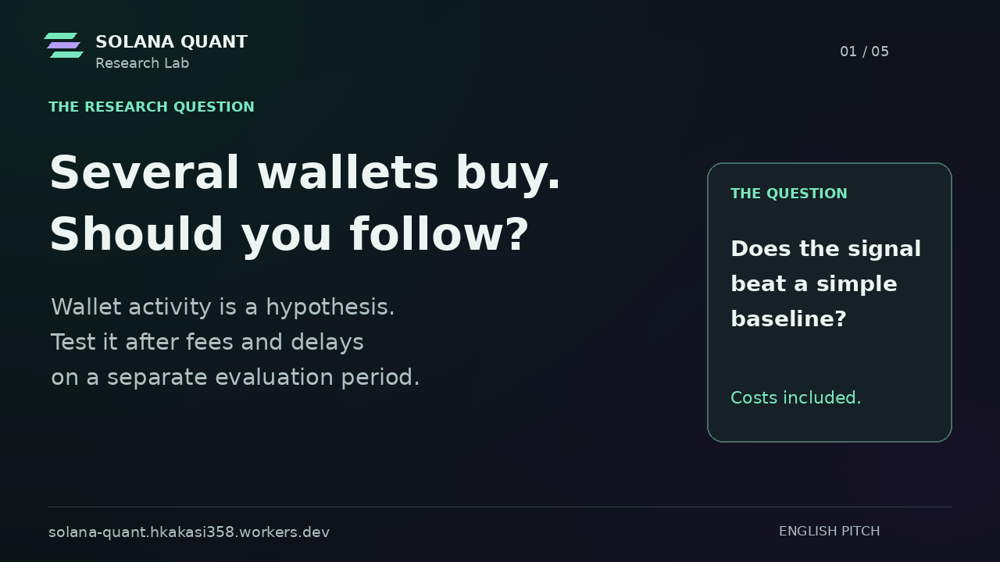

# Solana Quant Research Lab

[Live MVP](https://solana-quant.hkakasi358.workers.dev/) · [Open the audit](https://solana-quant.hkakasi358.workers.dev/audit/)

Audit wallet-based Solana hypotheses against buy-and-hold and fixed momentum after modeled costs, with frozen settings and reproducible trade evidence.

## Pitch

- [Download the narrated pitch video — MP4, 1:34](docs/submission/media/pitch.mp4)
- [Original supplied ElevenLabs narration — MP3, 1:32](docs/submission/media/pitch-audio.mp3)
- [Media details](docs/submission/media/README.md)

The pitch uses the team's supplied ElevenLabs voice with explanatory slides. It is not a product-demo screen recording or a claimed recording of a team member's natural voice.

## Current status

The live default demo is explicitly SYNTHETIC. Its wallet hypothesis gains +1.28% before modeled costs and loses −1.92% after costs; buy-and-hold earns +4.24% net in the same period. The browser audit was checked through training, freeze and holdout on 2026-10-05. REAL performance remains blocked by missing prices and historical-liquidity access.

The complete source and research package has been prepared; its publication to this repository is pending. The product-demo video, external video viewing URLs, team names and application submission are also pending.
