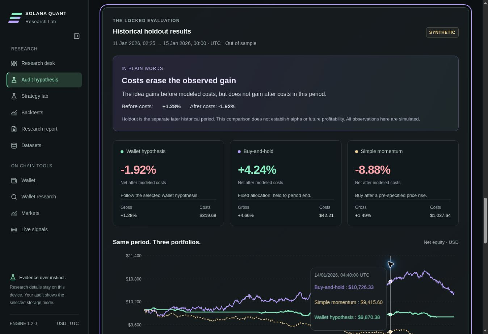

# Solana Quant Research Lab

**Audit a wallet-based Solana hypothesis against buy-and-hold and pre-specified momentum after modeled costs, then export the evidence for reproduction.**

[Live MVP](https://solana-quant.hkakasi358.workers.dev/) · [Documentation](docs/LOCAL_SETUP.md) · [Research report](research/reference/research_report.md) · [Submission kit](docs/submission/README.md)

Open the [live audit](https://solana-quant.hkakasi358.workers.dev/audit/) and follow **Training → Freeze → Holdout → Export**. The Cloudflare address was supplied by the team on 2026-10-05. The offline workflow runs entirely in the browser and requires no provider key or wallet connection.

The [pitch video](docs/submission/media/pitch.mp4) uses the team's supplied ElevenLabs narration, with explanatory visuals. The original [audio](docs/submission/media/pitch-audio.mp3) and [spoken script](docs/submission/PITCH_READ_EN.txt) are included. **The product demo video is still pending.** This README follows the structure of the organizer-supplied [submission example](https://github.com/Marakaya/colosseum_example), using this project's actual stack and evidence.

## Submission to the 2026 Colosseum hackathon

Submission preparation is in progress. The organizer's supplied checklist requires a two-minute pitch video, a demo video of at most three minutes, a GitHub repository following the example, and an MVP link, all in English. On 2026-10-05 the human team said its submission is due today before night. Follow the [same-day handoff](docs/submission/TODAY_EN.md); the exact cutoff/time zone, registered track and portal fields still need the team's confirmation. Do not substitute the public campaign's dates for this team deadline.

| Required link | Status |
|---|---|
| [Pitch video — under 2 minutes](docs/submission/media/pitch.mp4) | Prepared from team-supplied ElevenLabs audio; download MP4. External viewing URL pending |
| Product demo — under 3 minutes | Pending actual recording and reviewable video URL |
| [Team's GitHub source repository](https://github.com/Al1M0/SolanaProject) | Public source and research evidence |
| [MVP](https://solana-quant.hkakasi358.workers.dev/) | Team-provided Cloudflare address; browser audit verification recorded below |

| Team member | Role | Contact |
|---|---|---|
| Pending human confirmation | Pending human confirmation | Pending human confirmation |
| Pending human confirmation | Pending human confirmation | Pending human confirmation |

Names, backgrounds and contacts have not been supplied. [Development history](docs/submission/DEVELOPMENT_HISTORY.md) discloses the existing baseline and Codex-assisted work; no interviews, revenue or partnerships are claimed.

## Problem and Solution

The initial customer is an independent Solana researcher who checks wallet-based trading ideas manually using wallet analytics, explorer records, market history and spreadsheets or Python. This customer hypothesis has not yet been validated through interviews.

The product asks: **Does this smart-money hypothesis outperform a comparable baseline after costs on a separate evaluation period?** Its core workflow is:

1. State the hypothesis and select the wallet/token universe. Inspect the dataset's REAL/SYNTHETIC label, provenance, coverage and exclusions.
2. Inspect training versus both benchmarks and a pre-specified, training-only sensitivity grid.
3. Freeze the configuration; edits create another attempt instead of overwriting the old one.
4. Evaluate the chronological historical holdout. Compare gross/net returns, costs, drawdown, activity, missing observations and failed executions.
5. Inspect individual trades and export the manifest, permitted data, engine, results and report for reproduction.

A negative or inconclusive result is useful. Positive returns do not prove alpha, and a historical holdout is not guaranteed unseen. [Methodology and benchmark rules](docs/METHODOLOGY.md) document remaining selection bias and differences in exposure/turnover.

## Why Solana

Wallet transactions, token mints, timestamps and fees provide the actual event evidence for the hypothesis. The Helius adapter retrieves Solana history; independent public RPC records provide a separate reconciliation source. Birdeye supplies historical market observations when the account and token/window are covered. These sources can be incomplete and are not treated as ground truth without qualification.

Phantom provides optional message-signature login for saved server-side observations. Login does not submit a transaction. No on-chain program, automated trading, token or mainnet transaction is part of the audit. A devnet manifest receipt remains future work and would only timestamp a hash.

## Summary of Features

| Capability | Current evidence / boundary |
|---|---|
| Shared execution engine | Wallet strategy, fixed-allocation buy-and-hold and pre-specified momentum use the same capital, period, universe, availability rules and modeled cost assumptions. |
| Inspectable results | Gross/net returns, equity curves, drawdown, costs, trade count, exposure, turnover and trade evidence; unequal activity is reported. |
| Frozen experiments | Immutable configuration/content hashes and attempt history; hosted lifecycle records in D1, full hosted results device-local. Offline locks are device-only. |
| Training-only sensitivity | Seven pre-specified rows; no optimization on holdout. |
| Reproducibility | Credential-free ZIP and standard-library Python rerun with matching fingerprints/results. |
| Bounded real ingestion | Readiness, request budget, retries, progress/cancel and readable failures. Historical price/liquidity gaps block performance. |
| Supporting tools | Watch-only balances/history, market search/history and user-started wallet signal polling. Manual Phantom/browser interaction remains unverified here. |

**Working demonstration: SYNTHETIC, unchanged seed 33.** Its holdout is deliberately not tuned for profit:

| Portfolio | Gross return | Net return | Modeled costs | Trades |
|---|---:|---:|---:|---:|
| Wallet strategy | +1.2818% | −1.9150% | $319.68 | 32 |
| Fixed-allocation buy-and-hold | +4.6639% | +4.2418% | $42.21 | 4 |
| Pre-specified momentum | +1.4937% | −8.8826% | $1,037.64 | 104 |



Source: [unchanged reference summary](research/reference/summary.json). These simulated results are engineering evidence, not real Solana profitability. The holdout has only three completed daily-return observations and cannot establish statistical confidence.

**REAL performance is blocked.** Authorized keys retrieved actual history and historical prices. The first fixed 48-hour check retained 60 supported swaps from 1,519 transactions; five deterministic sells matched independent public RPC records. Required prices are incomplete and historical exit liquidity was denied. Birdeye support confirms Standard excludes the required endpoint and Lite is the minimum subscription; no upgrade was purchased. The separate three-wallet intake retains 74 supported swaps with incomplete second-wallet history. Manual explorer review and decoder coverage remain incomplete. See [REAL status](docs/REAL_STUDY.md), [first actual ingestion report](research/real-access-2026-10-03/research_report.md) and [three-wallet report](research/three-wallet-access-2026-10-03/research_report.md).

## Tech Stack

| Layer | Existing implementation |
|---|---|
| Frontend | Next.js, React, TypeScript, shared CSS and Lucide icons |
| Execution | Portable Python research engine; self-hosted Pyodide worker in the browser |
| Native API | FastAPI, SQLAlchemy, Alembic; verified SQLite path |
| Hosted API / persistence | Cloudflare-compatible Worker, Drizzle and D1 |
| Data / authentication | Helius, Birdeye, Solana RPC, CoinGecko, DEX Screener; Phantom signed-message sessions |

Docker/PostgreSQL is configured but not executed in this environment. [Architecture](docs/ARCHITECTURE.md) explains native/hosted persistence and trust boundaries.

## Architecture

The audit UI sends normalized observations and frozen configuration to the same Python execution modules, through either the native API or browser worker. Hosted provider requests and keys stay in the Worker; audit manifests/lifecycle hashes persist in D1. Browser-computed results are not server-certified. Exports carry the exact engine source and dataset fingerprint. See the [architecture document](docs/ARCHITECTURE.md) for the full flow.

## Quick Start

### Source checkout: synthetic browser demo

Requires Node.js 22+, npm and Python 3.12+. From the repository root:

```bash
npm ci
npm --prefix frontend ci
npm run build
python3 -m http.server 3000 --bind 127.0.0.1 --directory frontend/out
```

Open `http://localhost:3000/audit/`, enable **Offline audit**, then **Inspect training vs benchmarks → Freeze this configuration → Evaluate locked historical holdout → Download reproduction ZIP**. This path needs no provider keys or wallet. The release ZIP already includes `frontend/out`, so skip installation/build when using that archive. Provider/auth pages require the [native API or hosted app](docs/LOCAL_SETUP.md).

### Reproduce the committed study

```bash
python3 -m zipfile -e research/reference/reproduction.zip /tmp/quant-reference-reproduction
cd /tmp/quant-reference-reproduction
python3 reproduce.py
```

Reproduction requires standard-library Python 3.10+ and compares the data, engine and result fingerprints. [Local setup](docs/LOCAL_SETUP.md) preserves the full native launch, server settings, builds and verification commands.

## Roadmap

- [x] Preserve the offline app and implement the audit, shared-engine benchmarks, frozen attempts, training-only sensitivity and reproducible export.
- [x] Run native/hosted checks and collect genuine, bounded provider/reconciliation evidence with explicit coverage failures.
- [x] Prepare English pitch/demo scripts and this submission README.
- [ ] Complete historical-liquidity access, required price coverage and human explorer reconciliation; report the genuine result even if negative.
- [ ] Exercise the browser/Phantom flow, record actual feedback and interview five researchers.
- [x] Publish the narrated pitch MP4 and original narration to the team's GitHub.
- [x] Publish the complete source and research package to the team's GitHub.
- [ ] Publish the pitch on a video platform, record the product demo and complete submission fields.
- [ ] Future work: prospective paper experiments, defensible walk-forward folds and optional user-initiated devnet receipt.

## Resources

- [Live MVP — public viewing enabled](https://solana-quant.hkakasi358.workers.dev/)
- [Pitch video — MP4](docs/submission/media/pitch.mp4) and [original narration — MP3](docs/submission/media/pitch-audio.mp3)
- [English pitch script](docs/submission/PITCH_EN.md)
- [English demo script — recording pending](docs/submission/DEMO_EN.md)
- [Recording and GitHub handoff guide](docs/submission/RECORDING_AND_GITHUB.md)
- [Verification](docs/VERIFICATION.md), [limitations](docs/LIMITATIONS.md), [API](docs/API.md), [providers](docs/PROVIDERS.md)
- [Positioning](docs/submission/POSITIONING.md), [source-linked competitor comparison](docs/submission/COMPETITORS.md), [pricing assumptions](docs/submission/PRICING_AND_COSTS.md)
- [Usability task](docs/submission/USER_TEST.md), [five-user interview guide](docs/submission/INTERVIEWS.md), [feedback log](docs/submission/FEEDBACK_LOG.md), [judging Q&A](docs/submission/JUDGING_QUESTIONS.md)
- [Organizer's repository example](https://github.com/Marakaya/colosseum_example) and [official Colosseum FAQ](https://colosseum.com/hackathon?year=fall2026)

The complete source, research evidence, pitch MP4 and original narration are published to GitHub. The demo video, externally hosted video URLs and submission confirmation are still pending. The supplied narration is an ElevenLabs voice, not a claimed recording of a team member speaking. Team names/roles and registered event details still need human completion. See [current handoff](docs/submission/LINKS_TO_SUBMIT_EN.md).

## License

The human team has not selected a project license. No MIT or other license grant is implied by this README or by making a repository public. Dependency licenses and provider-data redistribution restrictions still apply.
